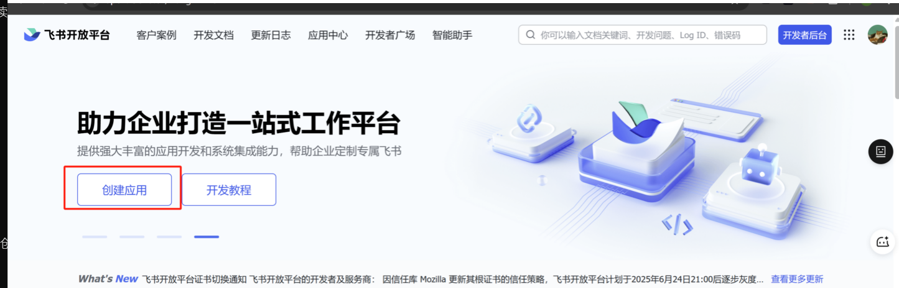
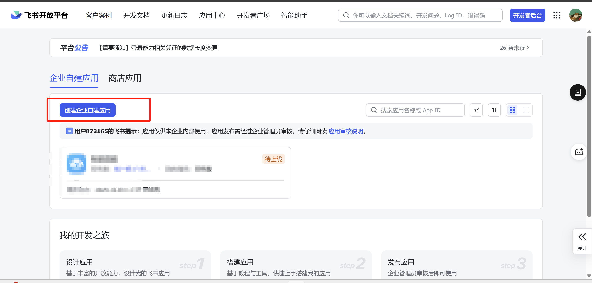
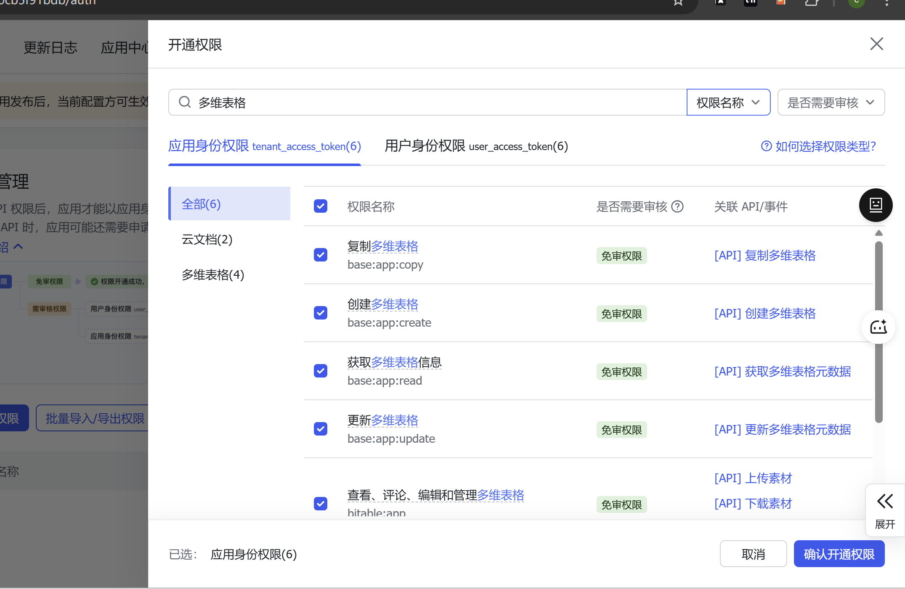
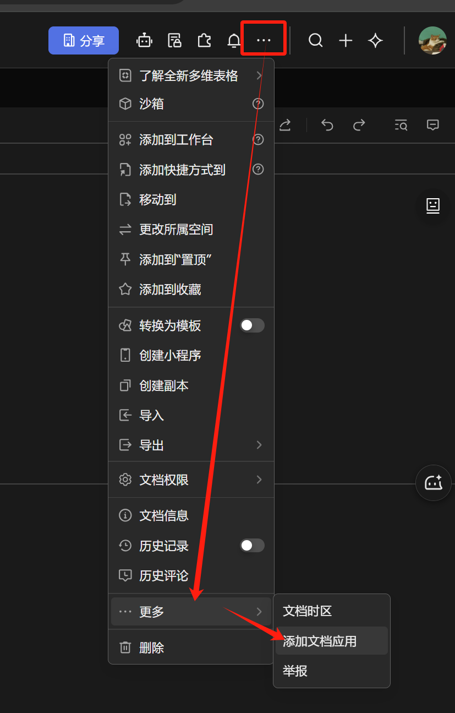

# Clip Plugin - 智能剪藏与 AI 助手扩展

这是一个基于 Plasmo 框架开发的 Chrome 浏览器扩展，集成了网页剪藏、截图标记、AI 摘要对话以及内容管理功能。
插件核心功能围绕 “便捷剪藏 + AI 赋能” 双轴展开：用户浏览网页时，无需切换软件或复制粘贴，通过插件一键触发剪藏功能，即可精准捕获目标内容 —— 无论是关键文本、重要图片、完整段落，还是包含多层链接的复杂页面片段，都能原样保存至插件本地库，同时支持自定义选区、标注重点、添加个人笔记等个性化操作，确保剪藏内容贴合自身需求。

## 🛠 技术栈 (Tech Stack)

- **框架**: [Plasmo](https://docs.plasmo.com/) (React + TypeScript) - 专为浏览器扩展开发的现代框架。
- **UI 库**:
  - [Tailwind CSS](https://tailwindcss.com/) - 实用优先的 CSS 框架。
  - [Radix UI](https://www.radix-ui.com/) / [Shadcn UI](https://ui.shadcn.com/) - 无头组件库，提供高质量的可访问性组件。
  - [React Icons](https://react-icons.github.io/react-icons/) - 图标库。
- **状态管理**:
  - [Jotai](https://jotai.org/) - 原子化状态管理 (用于全局配置如 API Key)。
  - React Context - 组件级状态共享。
- **AI 集成**: OpenAI API (通过 Background Service Worker 代理请求)。
- **构建工具**: Parcel (Plasmo 内置)。

## 🏗 软件架构 (Software Architecture)

本项目采用典型的 Chrome 扩展 MV3 (Manifest V3) 架构，分为 **Content Scripts (UI 层)**、**Background (业务逻辑层)** 和 **Popup/Options (配置层)**。

### 1. 核心模块划分

#### A. 内容脚本层 (Content Scripts) - `src/contents/`
负责将 UI 注入到目标网页，直接与 DOM 交互。
- **SidebarFloatPanel.tsx**: 核心交互面板。包含剪藏历史列表、AI 聊天窗口、深色模式切换等功能。使用 Shadow DOM 隔离样式。
- **screenshot-overlay.tsx**: 截图功能模块。提供区域选择、自动吸附 DOM 元素、标注和保存功能。
- **floatBtn.tsx**: 悬浮触发按钮，提供快速唤起面板的入口。
- **selection-clipper.tsx**: 监听用户选中文本，提供"发送到 AI 解读"的快捷操作。

#### B. 核心逻辑层 (Core Logic) - `src/core/`
采用**策略模式 (Strategy Pattern)** 处理不同类型网页的内容提取。
- **Extractors**: 通用提取器 (如 `readability.ts`)，用于普通网页的正文提取。
- **Handlers**: 特定站点处理器 (`src/core/handlers/`)。
  - `bilibili.ts`: 提取 B 站视频信息、字幕。
  - `youtube.ts`: 提取 YouTube 视频元数据。
  - `baike.ts`: 针对百科类站点的优化。
- **Index**: `extractContent` 函数根据 URL 自动分发到对应的 Handler。

#### C. 后台服务层 (Background) - `src/background/`
负责处理跨域请求、AI 对话流、右键菜单和消息路由。
- **Ports (`src/background/ports/`)**: 使用 Plasmo 的 Port API 处理长连接（主要用于 AI 流式对话）。
  - `chat.ts`: 处理与 OpenAI 的对话上下文维护和流式响应。
- **Messages (`src/background/messages/`)**: 处理单次异步请求，如获取视频字幕。

#### D. 数据存储层 (Data Layer) - `src/lib/`
- **ClipStore (`src/lib/clip-store.ts`)**: 封装 `chrome.storage.local`，提供 Clip 对象的增删改查接口。
- **Atoms (`src/lib/atoms/`)**: 定义 Jotai Atoms，持久化存储用户配置（如 OpenAI Key、Feishu 配置）。

### 2. 数据流向 (Data Flow)

1.  **用户交互**: 用户在 `SidebarFloatPanel` 输入问题或点击截图。
2.  **消息传递**:
    - **短消息**: UI 通过 `chrome.runtime.sendMessage` 发送指令（如截图、保存）。
    - **长连接**: AI 对话通过 `port.postMessage` 建立流式通信。
3.  **处理与响应**:
    - `Background` 接收消息，调用 OpenAI API 或执行复杂逻辑。
    - 结果通过 Message 或 Port 返回给 UI。
4.  **状态更新**: UI 接收数据更新 React State，或监听 `chrome.storage.onChanged` 自动刷新数据。

## 📂 目录结构说明 (Directory Structure)

```
src/
├── background/         # Service Worker 逻辑
│   ├── messages/       # 单次消息处理器
│   └── ports/          # 长连接(AI Chat)处理器
├── components/         # React 组件
│   ├── ui/             # 基础 UI 组件 (Button, Input, etc.)
│   └── ...             # 业务组件 (Chat, Transcript, etc.)
├── contents/           # Content Scripts (注入页面的 UI)
│   ├── SidebarFloatPanel.tsx  # 侧边栏主面板
│   ├── screenshot-overlay.tsx # 截图覆盖层
│   └── ...
├── contexts/           # React Contexts
├── core/               # 核心业务逻辑
│   ├── extractors/     # 通用提取器
│   └── handlers/       # 特定网站适配器 (Bilibili, YouTube)
├── lib/                # 工具库与存储
│   ├── atoms/          # Jotai 状态定义
│   └── clip-store.ts   # 剪藏数据存储管理
├── tabs/               # 独立页面 (如历史记录页)
└── style.css           # 全局样式 (Tailwind)
```

## ✨ 核心功能 (Key Features)

1.  **智能剪藏**: 自动识别页面类型（文章、视频），提取核心内容、元数据和字幕。
2.  **AI 助手**:
    - 上下文感知：基于当前页面内容进行问答。
    - 多模型支持：支持切换不同的 AI 模型。
3.  **高级截图**:
    - 自动吸附：智能识别网页元素边界。
    - 标注与保存：支持直接保存到剪藏库。
4.  **数据管理**: 本地化存储，支持查看历史记录、搜索和导出。
5.  **个性化**: 支持深色模式、界面拖拽（已简化为固定模式）、快捷键操作。

## ☁️ 飞书导出配置 (Feishu Export Configuration)
本插件支持将剪藏的内容自动同步至飞书多维表格 (Feishu Bitable)，实现数据的云端管理。请按照以下步骤完成配置：

1. 飞书开放平台设置
前往 飞书开放平台，登录并点击 “创建应用”，选择 “企业自建应用”。


进入应用详情页，在 “权限管理” 中搜索并开通 多维表格 (Bitable) 相关的读写权限（例如：bitable:app:read 和 bitable:app:read_write）。



在版本管理与发布中发布应用。

创建并发布一个应用版本以使权限生效。

在 “凭证与基础信息” 页面，复制 App ID 和 App Secret。

打开插件配置页，将这两个值填入对应的设置项中。

2. 多维表格文档设置
在飞书云文档中新建一个 多维表格 (Base)。

关键步骤：点击文档右上角的 “...” (更多) -> “添加应用”，搜索并在第一步创建的应用，将其添加为文档的 管理人员。


获取数据表标识：

Table Token (App Token): 打开多维表格，在浏览器 URL 中找到 base_ 开头的字符串（例如 bascnXXXXXXXX）。

Table ID: 打开多维表格，在浏览器 URL 中找到 table=...& ,复制 等于号之后 到 & 符号之前的内容。


将 Table Token 和 Table ID 填入插件配置页。

3. 完成配置
保存上述所有配置后，插件即可通过 API 自动将剪藏内容（标题、链接、摘要、标签等）写入到指定的飞书数据表中。